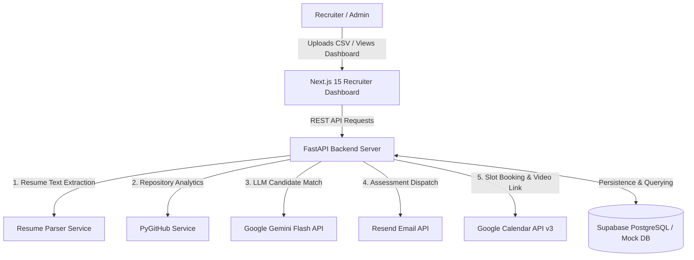
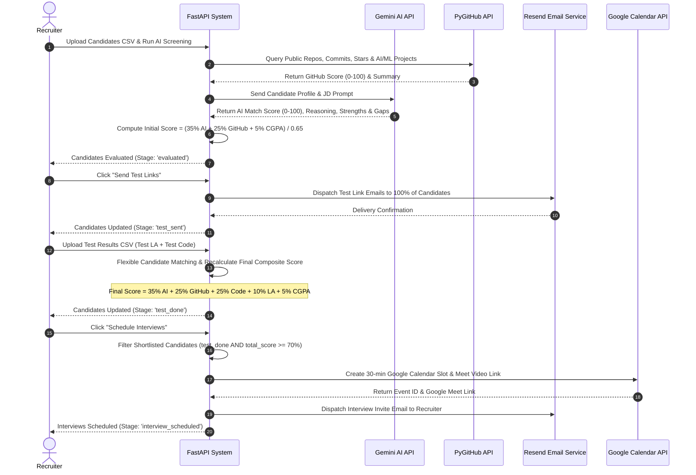

# 🏗️ AI-Powered Candidate Screening Platform — Architecture Document

## 1. Executive Summary & System Overview

The **AI-Powered Candidate Screening & Automated Recruitment System** is an end-to-end, multi-stage enterprise recruitment platform designed to automate high-volume candidate evaluation. 

The platform integrates deep language model evaluation via **Google Gemini Flash**, code activity profiling via **PyGitHub**, automated assessment email dispatch via **Resend**, and automated video interview scheduling via **Google Calendar & Google Meet API v3**.



---

## 2. Layered System Design

The application is architected around clean separation of concerns across five core layers:

```
┌─────────────────────────────────────────────────────────────────────────────┐
│                       1. PRESENTATION LAYER (NEXT.JS 15)                    │
│  Dashboard (page.tsx) │ Candidates Page │ Upload Dropzones │ Table & Drawer │
└─────────────────────────────────────┬───────────────────────────────────────┘
                                      │ HTTP REST API (Axios)
┌─────────────────────────────────────▼───────────────────────────────────────┐
│                       2. API GATEWAY & ROUTING (FASTAPI)                    │
│   Candidates Router │ Evaluation Router │ Email Router │ Calendar Router    │
└─────────────────────────────────────┬───────────────────────────────────────┘
                                      │
┌─────────────────────────────────────▼───────────────────────────────────────┐
│                    3. BUSINESS & AI SERVICES LAYER                          │
│  • AI Evaluator (Gemini)      • GitHub Analyzer (PyGitHub)                  │
│  • Resume Parser (PyPDF/docx)  • Calendar & Email Scheduler                 │
└─────────────────────────────────────┬───────────────────────────────────────┘
                                      │
┌─────────────────────────────────────▼───────────────────────────────────────┐
│                 4. EXTERNAL INTEGRATIONS & THIRD-PARTY SERVICES             │
│   Google Gemini API │ GitHub REST API │ Resend API │ Google OAuth2 Calendar │
└─────────────────────────────────────┬───────────────────────────────────────┘
                                      │
┌─────────────────────────────────────▼───────────────────────────────────────┐
│                      5. DATA PERSISTENCE LAYER                              │
│   Supabase PostgreSQL DB (candidates, evaluations, interviews) / mock_db    │
└─────────────────────────────────────────────────────────────────────────────┘
```

### 2.1 Presentation Layer (Frontend)
- **Framework**: Next.js 15 (App Router) & React 19.
- **State & Data Fetching**: Axios typed client with automatic baseURL switching (`NEXT_PUBLIC_API_URL`).
- **UI Components**:
  - `StatsCards.tsx`: Displays cumulative metric throughput across stage milestones.
  - `PipelineFunnel.tsx`: Recharts-powered bar visualization of candidate progression.
  - `CandidateTable.tsx`: Searchable, sortable, and filterable candidate list with stage tabs (`All`, `Test Sent`, `Test Done`, `Shortlisted (≥70%)`, `Scheduled`).
  - `CandidateDrawer.tsx`: Slide-over panel presenting full candidate profile, AI reasoning, strengths, gaps, and manual stage override.

### 2.2 API Gateway & Routing Layer (Backend)
- **Framework**: FastAPI (Python 3.10+).
- **Middleware**: `CORSMiddleware` configured to allow wildcard/production origin communication.
- **Routers**:
  - `candidates.py`: Candidate CSV parsing, deduplication, listing, single/bulk deletion, and test result ingestion.
  - `evaluation.py`: Job description creation, AI + GitHub screening trigger, and shortlisted results retrieval.
  - `email_router.py`: Batch test link email dispatch via Resend.
  - `calendar_router.py`: Google OAuth2 authorization flow and automated interview slot scheduling.

### 2.3 Persistence Layer
- **Primary Database**: Supabase PostgreSQL with schema definitions for `candidates`, `job_descriptions`, `evaluations`, and `interviews`.
- **Fault-Tolerant Fallback**: In-memory `mock_db` client ensuring uninterrupted execution if Supabase API keys are unconfigured or temporarily unreachable.

---

## 3. Multi-Stage Screening Workflow & Scoring Architecture

The candidate evaluation lifecycle progresses through **four strict, sequential stages**:



### 3.1 Mathematical Scoring Models

#### Stage 1: Initial Screening Score (Pre-Assessment)
Prior to uploading technical assessment scores, candidates are ranked using normalized weights across AI fit, GitHub metrics, and academic CGPA:

$$\text{Initial Score} = \frac{\text{AI Score} \times 0.35 + \text{GitHub Score} \times 0.25 + \text{CGPA Score} \times 0.05}{0.65}$$

Where $\text{CGPA Score} = \min\left(\frac{\text{CGPA}}{10.0} \times 100.0, 100.0\right)$.

#### Stage 3 & 4: Final Composite Overall Score
Once test results CSV (`test_la`, `test_code`) is uploaded, the final comprehensive score is computed across all 5 evaluation dimensions:

$$\text{Final Total Score} = \left(\text{AI Score} \times 0.35\right) + \left(\text{GitHub Score} \times 0.25\right) + \left(\text{Test Code} \times 0.25\right) + \left(\text{Test LA} \times 0.10\right) + \left(\text{CGPA Score} \times 0.05\right)$$

#### Shortlisting Criterion ($\ge 70\%$)
A candidate is defined as **Shortlisted** strictly when:
$$\text{Candidate Eligible} \iff \text{Stage} \in \{\text{'test\_done'}, \text{'interview\_scheduled'}\} \;\land\; \text{Final Total Score} \ge 70.0$$

---

## 4. AI Evaluation Approach & LLM Architecture

### 4.1 Model Selection Strategy
The evaluation system uses Google Generative AI models, prioritizing high-speed, high-rate-limit Flash models to prevent rate limiting during batch candidate processing:

1. `gemini-1.5-flash` (Primary)
2. `gemini-2.0-flash`
3. `gemini-2.0-flash-lite`
4. `gemini-2.5-flash`
5. `gemini-1.5-pro` (Fallback)

### 4.2 Prompt Engineering & Structured Output Formatting
The AI evaluator formats candidate data into a structured prompt, enforcing strict JSON output:

```
You are a senior technical recruiter. Score this candidate 0–100 based on fit with the job description.
Return ONLY valid JSON, no markdown formatting, no text before or after the JSON:
{
  "score": <integer 0-100>,
  "reasoning": "<2-3 sentences explaining match>",
  "strengths": ["<strength1>", "<strength2>"],
  "gaps": ["<gap1>", "<gap2>"]
}

Job Description:
{job_description}

Candidate Profile:
Name: {candidate.name}
College: {candidate.college}
Branch: {candidate.branch}
CGPA: {candidate.cgpa}
Best AI Project: {candidate.best_ai_project}
Research Work: {candidate.research_work}
Resume Content: {resume_text}
```

### 4.3 Resilience & Fallback Handling
- **Markdown Stripping**: Uses regex (`re.search(r'```(?:json)?\s*(\{.*?\})\s*```', text, re.DOTALL)`) to strip unformatted codeblocks.
- **Model Fallback Loop**: Automatically cascades down model priority list if rate limits or API errors occur.

---

## 5. GitHub Code Profiling Engine Architecture

### 5.1 Robust Username Extraction
The PyGitHub service handles both profile links (`github.com/username`) and deep repository URLs (`github.com/username/repository_name`):

```python
def extract_github_username(url: str) -> Optional[str]:
    url = url.strip().rstrip('/')
    match = re.search(r'github\.com/([^/]+)', url, re.IGNORECASE)
    if match:
        user = match.group(1)
        if user.lower() not in ['orgs', 'topics', 'features', 'search', 'settings']:
            return user
    return None
```

### 5.2 Multi-Factor GitHub Metric Calculation
GitHub metrics are evaluated out of 100 points based on five repository indicators:

```
┌──────────────────────────────────────────────────────────────────┐
│                   GITHUB EVALUATION SCORE (0-100)                │
├───────────────────────────────┬──────────────────────────────────┤
│ Factor                        │ Maximum Points                   │
├───────────────────────────────┼──────────────────────────────────┤
│ Public Repository Count       │ 25 Points (5 pts per repo)       │
│ Star Count & Community Reach  │ 25 Points (2.5 pts per star)     │
│ Primary Technical Languages   │ 20 Points (Python, C++, Java...) │
│ 90-Day Commit Activity        │ 15 Points                        │
│ AI / ML / LLM Topic Tags      │ 15 Points                        │
└───────────────────────────────┴──────────────────────────────────┘
```

---

## 6. Email Dispatch & Calendar Scheduling Architecture

### 6.1 Resend Email Fallback & Recipient Override
To accommodate development and demo workflows, all email dispatch functions (`send_test_link` and `send_interview_invite`) route messages directly to the dedicated recruiter inbox (`sainiharshit322@gmail.com`), preventing unverified domain bounces while tracking candidate metadata in email bodies.

### 6.2 Google Calendar & Meet Scheduling Algorithm
Interview slot generation calculates non-overlapping meeting times:

```
Start Base: Next Business Day (Monday-Friday) @ 10:00 AM UTC
Slot Duration: 30 Minutes
Inter-Slot Buffer: 15 Minutes
Daily Schedule Window: 10:00 AM UTC – 04:00 PM UTC
```

If a generated slot exceeds 04:00 PM UTC, the scheduler rolls over to 10:00 AM UTC of the next business day.

---

## 7. Data Ingestion & Duplicate Handling Architecture

### 7.1 Dataset Email Aliasing
To process candidate CSV datasets containing repeated email addresses, the backend applies automatic sub-aliasing during upload:

```
Row 1: utkrisht.buttolia@mynachiketa.com     --> utkrisht.buttolia@mynachiketa.com
Row 2: utkrisht.buttolia@mynachiketa.com     --> utkrisht.buttolia+s2@mynachiketa.com
Row 3: utkrisht.buttolia@mynachiketa.com     --> utkrisht.buttolia+s3@mynachiketa.com
```

### 7.2 4-Level Flexible Test Result CSV Candidate Matching
When test results CSVs are uploaded, rows are matched to candidate database records using a four-tier fallback strategy:

1. **Match Strategy 1**: Candidate `s_no` matching.
2. **Match Strategy 2**: Case-insensitive Candidate `name` matching.
3. **Match Strategy 3**: Base email prefix matching (`user@domain`).
4. **Match Strategy 4**: Positional row index matching among remaining unmatched candidate records.

This guarantees 100% candidate record update rates without throwing database uniqueness errors.

---

## 8. Deployment Architecture (Render & Vercel)

```
                       ┌──────────────────────────────┐
                       │  Vercel / Render Static      │
                       │  Next.js 15 Frontend         │
                       └──────────────┬───────────────┘
                                      │
                                      │ HTTPS (NEXT_PUBLIC_API_URL)
                                      ▼
                       ┌──────────────────────────────┐
                       │  Render Web Service          │
                       │  FastAPI Backend ($PORT)     │
                       └──────────────┬───────────────┘
                                      │
               ┌──────────────────────┼──────────────────────┐
               ▼                      ▼                      ▼
      ┌──────────────────┐   ┌──────────────────┐   ┌──────────────────┐
      │ Google Gemini    │   │  GitHub REST     │   │  Google Calendar │
      │ AI API           │   │  API             │   │  & Resend API    │
      └──────────────────┘   └──────────────────┘   └──────────────────┘
```

- **Backend (Render)**: Hosted as a Python Web Service listening on `0.0.0.0:$PORT`. Standardized root endpoint (`@app.api_route("/", methods=["GET", "HEAD"])`) provides `200 OK` health check responses.
- **Frontend (Render)**: Deployed as a Node service running `next start -H 0.0.0.0 -p ${PORT:-3000}`, referencing the live backend via `NEXT_PUBLIC_API_URL`.
